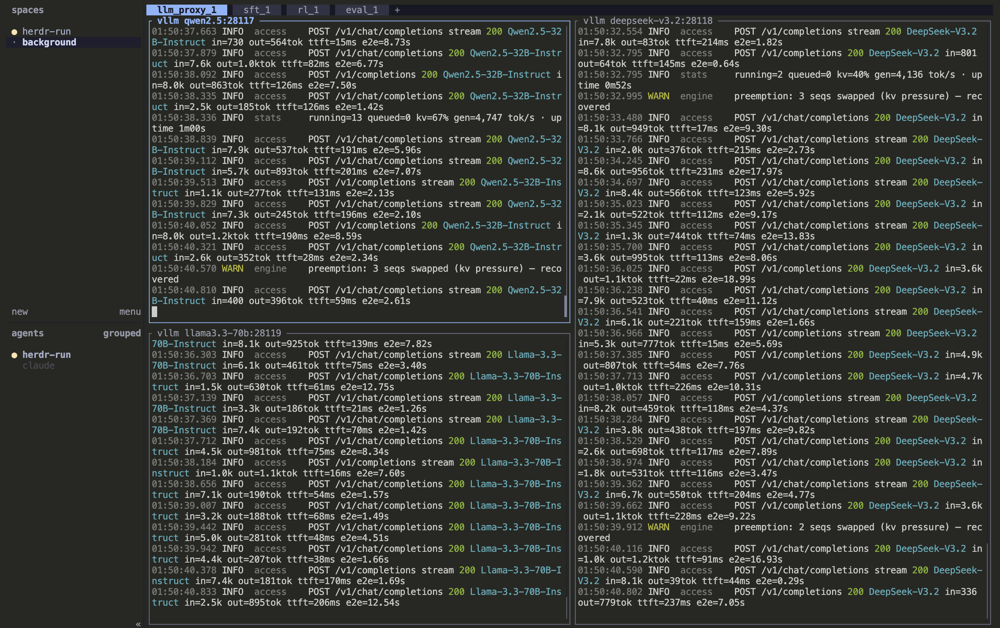

# herdr-run

[中文](README.md) | **English**

A [Herdr](https://herdr.dev) skill for AI coding agents (Claude Code and friends): when an agent needs to run long-lived processes (servers, LLM proxies, training, evals...), instead of `nohup`-ing them somewhere you can't see, they land in a dedicated `background` workspace in Herdr — **each process runs in the foreground of its own terminal pane**, so you can switch over anytime to watch it live, stop it with Ctrl-C, while the full output is tee'd to disk.



## The problem it solves

The usual fate of asking an agent to start a background service:

- The process sits in some detached shell; you can't tell whether it's running or stuck
- Want the output? Long gone, or scattered across the agent's temp files
- Want to stop it? Start by hunting down the PID
- Five services in, who owns port 8000 is anyone's guess

herdr-run keeps all of this in one place. You just talk to the agent as usual; the rest is between it and Herdr.

## Installation

Prerequisites: [herdr](https://herdr.dev) (`herdr --version` works; macOS / Linux / Windows — on Windows install with `irm https://herdr.dev/install.ps1 | iex`, or use WSL) and Python 3. **For the best experience, use this skill inside Herdr.**

### One-line install (recommended, works for 40+ agents)

```bash
npx skills add yhj137/herdr-run
```

`npx skills` is the universal installer of the [agent skills ecosystem](https://github.com/antfu/skills-cli). It auto-detects which agents are installed on your machine (Claude Code, Codex, Cursor, Gemini CLI, OpenCode, ...) and installs the skill into each one's skills directory.

### Manual install for Claude Code

```bash
# global (available in every project)
git clone https://github.com/yhj137/herdr-run ~/.claude/skills/herdr-run

# or project-level (this project only)
git clone https://github.com/yhj137/herdr-run <project>/.claude/skills/herdr-run
```

### Other agents

`SKILL.md` is an open standard ([Agent Skills](https://code.claude.com/docs/en/skills)); mainstream agents (Codex, Cursor, Gemini CLI, OpenCode, ...) all understand it — just drop this repo into your agent's skills directory. Not sure where that is? Use the one-line installer above.

## What you'll see once installed

A `background` workspace appears in Herdr. Every background process lives there, grouped into tabs by purpose, at most 4 panes per tab in a 2×2 grid — the 5th process of the same kind automatically opens the next tab:

```
background workspace
├── llm_proxy_1            ← tab 1 of purpose llm_proxy
│   ┌────────────────┬────────────────┐
│   │ vllm api       │ vllm api       │   ← one foreground process per pane
│   │ proxy:28117    │ proxy:28118    │      name = note:port
│   ├────────────────┼────────────────┤
│   │ vllm api       │  (free slot)   │
│   │ proxy:28119    │                │
│   └────────────────┴────────────────┘
└── rollout_1
```

You can:

- **Watch** — switch to the `background` workspace; output is scrolling right there
- **Stop** — select the pane and press Ctrl-C, exactly like in your own terminal
- **Find logs** — every process's full output is tee'd to `<project>/logs/<purpose>/<datetime>-<note>.log`
- **Check history** — the launch registry `logs/launches.jsonl` (project-level, beside the logs) records every launch (time, full command, ports, pane, log path). Consider adding `logs/` to your project's `.gitignore` — process output and launch records live there and may contain secrets

## How to use it

No commands to memorize — just talk normally:

> Start a vLLM proxy listening on 28117, and give me the address once it's reachable
> Put the training run in the background; I want to check progress anytime
> Are those 5 watchers still running?

The agent invokes this skill to handle placement, naming, logging and records, then tells you where the pane is and where the log lives.

## Purpose naming: the agent asks first

Tabs and log directories are organized by **purpose** (short slugs like `llm_proxy`, `rollout`, `sft`). Purpose names are a shared vocabulary between you and the agent, so it never invents `proxy2` or `server_final` and litters your workspace with tabs:

- Registered purposes are reused as-is — the 2nd, 3rd, 4th process of a kind go into the same tab series
- For a **genuinely new** purpose the agent asks you to name it first (if you already named it in your request, that counts as consent)
- The registry has **no file of its own**: known purposes = the launch record file ∪ live `{purpose}_n` tabs. The record file defaults to the project's `logs/launches.jsonl` (beside the logs — the skill itself stores no data anywhere; relocate via `HERDR_RUN_RECORD_FILE` / `--record-file`), one line per launch. To prune or fix the vocabulary, edit that JSONL directly — a deleted purpose simply gets asked about again next time
- See registered purposes: `python3 ~/.claude/skills/herdr-run/scripts/herdr_run.py list --purposes`; see running processes: the same command with no arguments

## Command reference

Rarely needed — kept here for reference (`$S` = `herdr_run.py` under the skill's install directory; the example assumes a global Claude Code install):

```bash
S=~/.claude/skills/herdr-run/scripts/herdr_run.py

python3 $S launch <purpose> "<full command>" [--note note] [--port port]   # start
python3 $S list                                 # process overview (with the last 8 screen lines of each pane)
python3 $S list --purposes                      # registered purposes
python3 $S list --history                       # everything ever launched
```

Launch options: `--cwd` working directory (default: current), `--log-dir` log root (default `<cwd>/logs`), `--new-purpose` register a new purpose, `--no-record` skip the launch registry, `--focus` focus the new tab, `--dry-run` print the placement plan only; see SKILL.md for the full list.

Follow-up control goes through herdr itself: `herdr pane read <pane_id> --source recent-unwrapped` to read output, `herdr pane send-keys <pane_id> ctrl+c` to stop.

## FAQ

**What happens to a pane after its process exits?**
The pane stays, showing its last output. A new launch **always gets a fresh pane** — existing panes are never reused, even idle ones: a pane belongs to its launch until you close it, and closing panes is how slots are freed. Once a tab is full (4 panes), the 5th process of the kind opens the next tab.

**Where does the note in log filenames come from?**
The short note the agent chose at launch (`--note`), which doubles as the pane title. Example: `260829-221549-vllm-api-proxy.log`.

**Why do pane names contain ports like `:28117`?**
Any process that listens on a port carries that port in its pane name, so port conflicts are visible at a glance. Multiple ports are comma-separated.

**Where is the launch registry?**
In the project's `logs/launches.jsonl`, beside the logs — the skill itself stores no data; all runtime data stays in your project. To relocate it: the `HERDR_RUN_RECORD_FILE` env var or `--record-file`; to skip recording for one launch: `--no-record`. Remember to add `logs/` to your project's `.gitignore`.

**Does it work on Windows?**
Yes. Panes on Windows are PowerShell; the script uses an explicit UTF-8 writer that echoes every line live and writes the same bytes to the log. Commands with multiple lines or nested quotes are best written to a `.ps1` and launched with `powershell.exe -NoProfile -ExecutionPolicy Bypass -File C:\path\job.ps1`; WSL works fine too.
